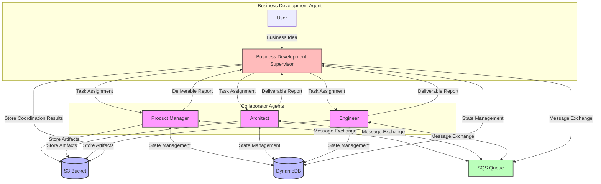
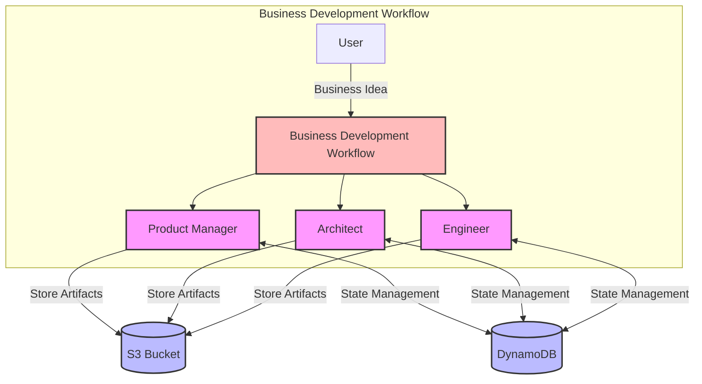
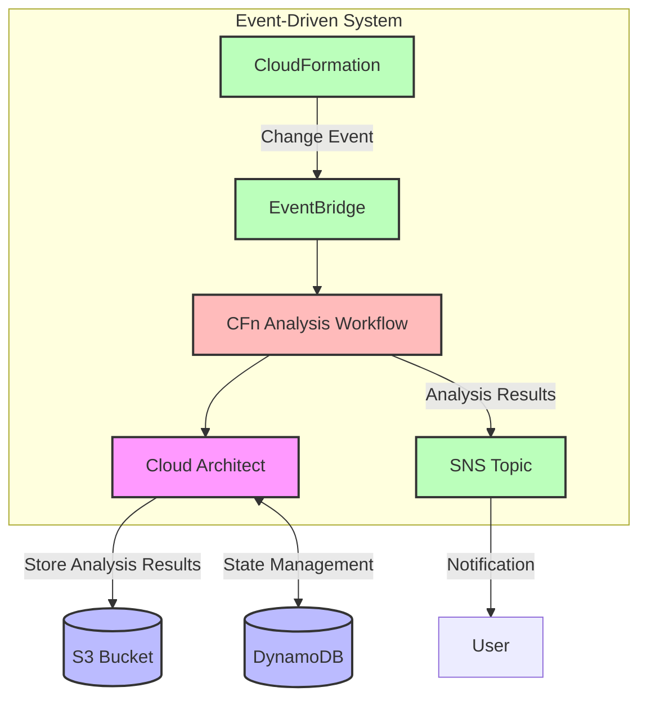
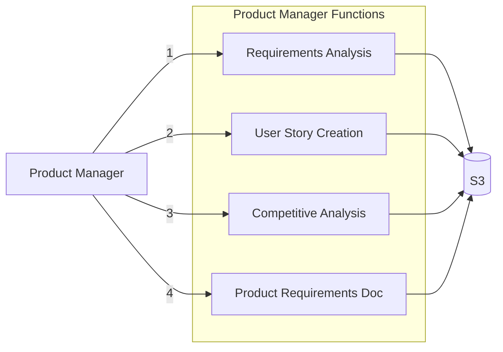
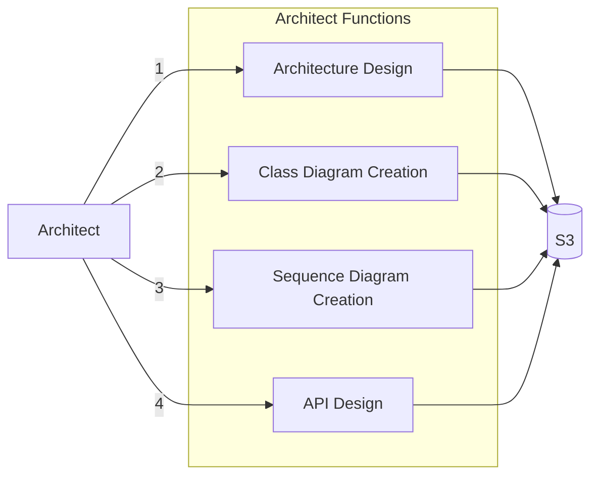
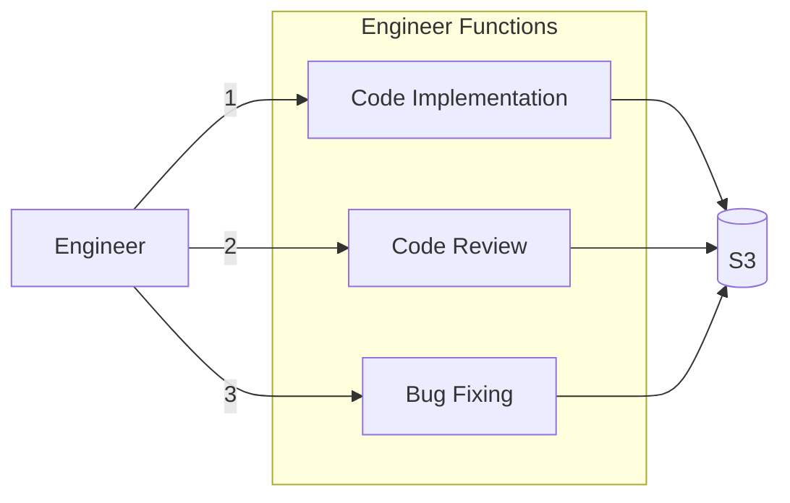
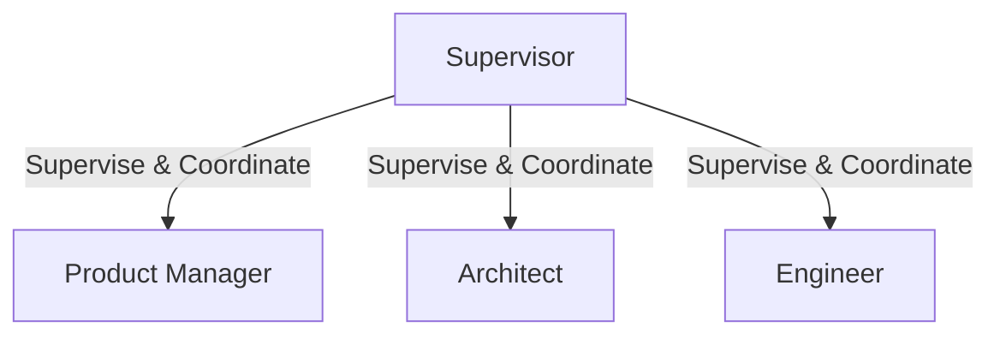
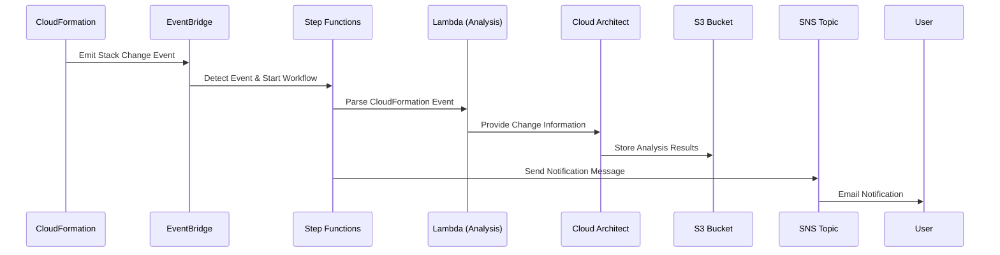
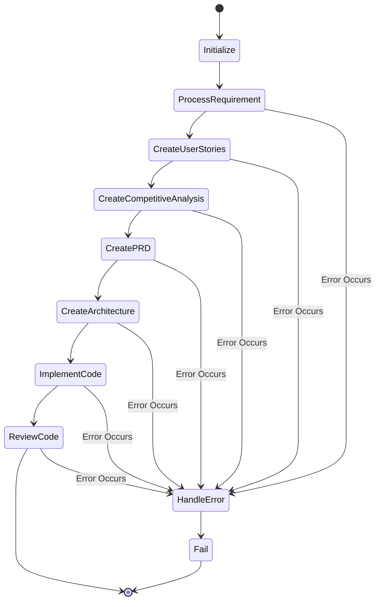
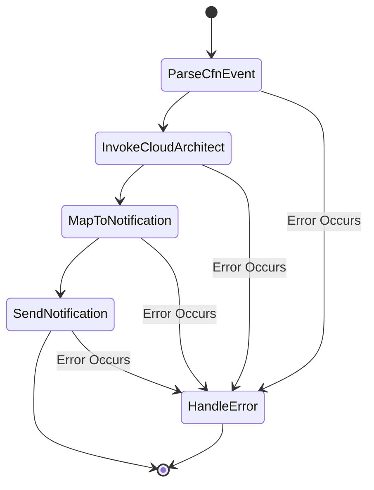

<div markdown="1" align="center">
  <h1>multi-agent-samples-jp</h1>

English | [日本語](./README_ja.md)

Sample implementation of multi-agent systems using AWS Bedrock. This project aims to automate and improve software development processes using AI agents.

</div>

## Project Overview

This project is a sample implementation of multi-agent systems using AWS Bedrock, consisting of the following key components:

1. **Multi-Agent Collaboration**
   - **Business Development Multi-Agents (Collaborators)** - Multiple agents specialized in specific domains
   - **Business Development Multi-Agents (Supervisor)** - Agent that supervises and coordinates collaborator agents
2. **Agentific Workflow**
   - **Business Development Workflow** - Workflow that executes each agent in a predefined order
3. **Event-Driven Agents**
   - **CloudFormation Analysis Event-Driven Agent** - Automatically detects and analyzes infrastructure changes

## System Architecture

### Business Development Multi-Agents



### Business Development Workflow



### CloudFormation Analysis Event-Driven Agent



## Architecture Features

- **IaC**: All resources coded using AWS CDK
- **Serverless Architecture**: Leveraging Lambda, Step Functions, DynamoDB, S3, and other managed services
- **Event-Driven Design**: Loosely coupled components using EventBridge, SQS, SNS
- **Stateful Workflows**: Complex workflow management with Step Functions
- **Scalable Storage**: Efficient data management with S3 and DynamoDB

## Key Component Details

### 1. Business Development Multi-Agents (Collaborators)

Each agent specializes in a specific domain and collaborates with others.

#### Product Manager



- **Requirements Analysis**: Detailed analysis of user requirements, identifying key features and target users
- **User Story Creation**: Creating stories in the format "As a [user], I want to [action], so that [benefit]"
- **Competitive Analysis**: Analyzing market competitors and identifying differentiation points
- **PRD Creation**: Creating comprehensive product requirement documents to guide development

#### Architect



- **Architecture Design**: Designing the overall system structure and technology choices
- **Class Diagram Creation**: Creating object-oriented design class structures in Mermaid format
- **Sequence Diagram Creation**: Creating sequence diagrams for important use cases in Mermaid format
- **API Design**: Creating detailed designs for RESTful APIs or GraphQL APIs

#### Engineer



- **Code Implementation**: Implementing actual code based on architecture and requirements
- **Code Review**: Evaluating implemented code for quality, performance, and security
- **Bug Fixing**: Fixing issues identified in reviews to improve code quality

### 2. Business Development Multi-Agents (Supervisor)



- **Agent Coordination**: Appropriately assigning and coordinating roles and tasks for each agent
- **Communication Management**: Facilitating information transfer between agents
- **Progress Monitoring**: Monitoring overall project progress and intervening when necessary
- **Quality Assessment**: Evaluating the quality of each agent's output and promoting improvements
- **User Bridging**: Mediating communication between users and the agent team

### 3. CloudFormation Analysis Event-Driven Agent



- **Automatic Detection**: Automatically detecting CloudFormation stack changes
- **Detailed Analysis**: Detailed analysis of the cause and impact scope of changes
- **Correction Proposals**: Proposing specific corrections for problem resolution
- **Notification**: Notifying stakeholders of analysis results through SNS topics

## Technical Stack Details

- **AWS CDK**: Infrastructure as code using TypeScript
- **AWS Bedrock**: Advanced natural language processing with Claude 3.5 Sonnet model and Multi Agent Collaboration
- **AWS Lambda**: Serverless implementation in Python
- **AWS Step Functions**: Definition and execution of complex workflows
- **DynamoDB**: Storage of agent states and conversation history
- **S3**: Storage of analysis results, design documents, implementation code
- **SQS/SNS/EventBridge**: Event-driven architecture
- **CloudWatch**: Log management, metrics monitoring, alert configuration

## Workflow Details

### Business Development Workflow



1. **Initialization**: Generating project ID and setting necessary fields
2. **Requirement Processing**: Analysis of requirements by the Product Manager
3. **User Story Creation**: Defining features from a user perspective
4. **Competitive Analysis**: Analyzing the market and competing products
5. **PRD Creation**: Creating a comprehensive product requirements document
6. **Architecture Creation**: System design and technology selection
7. **Code Implementation**: Actual coding work
8. **Code Review**: Quality evaluation and improvement suggestions for implementation

### CloudFormation Analysis Workflow



1. **Event Parsing**: Parsing details of CloudFormation events
2. **Cloud Architect Invocation**: Executing AI agent for change analysis
3. **Notification Mapping**: Converting analysis results to notification format
4. **Notification Sending**: Notifying stakeholders through SNS topic

## Installation

### Prerequisites

- AWS CLI version 2.0+
- Node.js version 14.0+
- npm version 6.0+
- AWS CDK version 2.0+
- AWS account with appropriate IAM user permissions

### Detailed Setup Instructions

1. Clone the repository
```bash
git clone https://gitlab.aws.dev/wmikuriy/multi-agent-samples-jp.git
cd multi-agent-samples-jp
```

2. Install dependencies
```bash
npm install
```

3. Bootstrap CDK (first time only)
```bash
cdk bootstrap
```

4. Set environment variables
```bash
# Required environment variables
export AWS_REGION=us-west-2  # Deployment region

# Optional environment variables
export ENV_NAME=dev  # Environment name (default is 'dev')
export NOTIFICATION_EMAIL=your-email@example.com  # Notification email
```

5. Deploy
```bash
# Deploy all stacks
cdk deploy --all

# Deploy specific stack
cdk deploy mas-jp-bizdev-ma-agent-dev
```

6. Post-deployment verification
```bash
# List deployed stacks
cdk list

# Display stack outputs
aws cloudformation describe-stacks --stack-name mas-jp-bizdev-ma-agent-dev --query "Stacks[0].Outputs"
```

## Usage

### Running the Business Development Workflow

1. Log in to AWS Management Console
2. Navigate to Step Functions console
3. Select `mas-jp-bizdev-wf-dev-main-workflow` state machine
4. Click "Start execution"
5. Provide input like:
```json
{
  "requirement": "I want to manage household finances with a mobile app. I want to record income and expenses, view aggregations by category, and check monthly reports. I also want budget setting and notification features.",
  "user_id": "user123"
}
```
6. Monitor execution progress in the Step Functions visualization tool
7. Check the output of each step in the S3 bucket

### Testing CloudFormation Analysis

1. Create a test CloudFormation stack and intentionally make it fail:

```bash
# Example of a failing CloudFormation template
cat > failed-template.yaml << EOF
Resources:
  MyBucket:
    Type: AWS::S3::Bucket
    Properties:
      BucketName: this-bucket-name-probably-exists-already
EOF

# Deploy the stack
aws cloudformation create-stack --stack-name test-failure --template-body file://failed-template.yaml
```

2. When the CloudFormation stack fails, analysis will automatically begin
3. Analysis results will be notified via email through the configured SNS topic
4. Check the execution of the `mas-jp-cfnfa-ed-dev-cfn-analysis` state machine in the Step Functions console
5. View detailed analysis reports in the S3 bucket

## Advanced Usage

### Adding Custom Agents

This framework is extensible, allowing you to add new agent types:

1. Create a Lambda function for the new agent:
   - Create a new folder in the `lambda/action_group/custom/` directory
   - Implement necessary handlers and helper functions

2. Create an agent construct:
   - Create a new file in the `lib/constructs/agent/custom/` directory
   - Implement based on existing agent constructs

3. Add the new agent to the stack:
   - Edit the appropriate stack file to integrate the new agent

### Customizing Workflows

Step Functions workflows can be flexibly customized:

1. Edit files in the `lib/constructs/workflow/` directory
2. Add new steps, modify existing steps, or add conditional branches
3. Deploy changes to apply the new workflow


### Security Considerations　in Production

When using this sample code in a production environment, please consider the following:

1. **Authentication & Authorization**
   - Configure appropriate IAM roles and policies following the principle of least privilege
   - Implement authentication for API endpoints using Cognito or API Gateway
   - Introduce proper authentication mechanisms for inter-agent communications

2. **Data Protection**
   - Enable encryption for S3 buckets (SSE-S3, SSE-KMS)
   - Enable encryption for DynamoDB tables
   - Use TLS/SSL for data in transit
   - Manage sensitive information with AWS Secrets Manager

3. **Guardrails**
   - Configure appropriate guardrails for Bedrock models to prevent harmful outputs
   - Implement input validation and output filtering
   - Clearly limit the scope and permissions of agent actions

For additional security measures in LLM applications, refer to resources such as [OWASP Top 10 for Large Language Model Applications](https://owasp.org/www-project-top-10-for-large-language-model-applications/).

## Project Structure Details

```
.
├── bin/                      # CDK application entry point
│   └── multiagent-framework.ts  # Main CDK app definition
├── lib/                      # CDK stacks and constructs
│   ├── constructs/           # Reusable constructs
│   │   ├── agent/            # Agent definitions
│   │   │   ├── aws/          # AWS-specific agents
│   │   │   │   ├── cloud-architect.ts    # Cloud Architect agent
│   │   │   │   ├── index.ts              # AWS agent exports
│   │   │   │   └── serverless-architect.ts # Serverless Architect agent
│   │   │   └── bizdev/       # Business development agents
│   │   │       ├── architect.ts          # Architect agent
│   │   │       ├── data-interpreter.ts   # Data Interpreter agent
│   │   │       ├── engineer.ts           # Engineer agent
│   │   │       ├── index.ts              # Business development agent exports
│   │   │       └── product-manager.ts    # Product Manager agent
│   │   ├── event-driven/     # Event-driven constructs
│   │   │   └── cloudformation-analysis.ts # CloudFormation analysis construct
│   │   ├── infrastructure/   # Infrastructure resources
│   │   │   ├── api-lambda.ts            # API Lambda function
│   │   │   ├── lambda-resources.ts      # Common Lambda resources
│   │   │   ├── messaging-resources.ts   # Messaging resources
│   │   │   └── storage-resources.ts     # Storage resources
│   │   ├── multi-agents/     # Multi-agent collaboration
│   │   │   └── bizdev/       # Business development multi-agents
│   │   │       └── bizdev-supervisor.ts  # Business development supervisor
│   │   └── workflow/         # Workflow definitions
│   │       └── bizdev-workflow.ts       # Business development workflow
│   ├── bizdev-ma-agent-stack.ts    # Business development multi-agent stack
│   ├── bizdev-ma-supervisor-stack.ts # Supervisor stack
│   ├── bizdev-wf-stack.ts    # Business development workflow stack
│   └── cfnfa-ed-stack.ts     # CloudFormation analysis stack
├── lambda/                   # Lambda function source code
│   └── action_group/         # Agent action groups
│       ├── aws/              # AWS-related Lambdas
│       │   ├── cfn-event-parser/       # CloudFormation event parsing
│       │   ├── cloud-architect/        # Cloud Architect
│       │   └── serverless-architect/   # Serverless Architect
│       └── bizdev/           # Business development-related Lambdas
│           ├── architect/              # Architect
│           ├── engineer/               # Engineer
│           └── product-manager/        # Product Manager
├── package.json              # Project dependencies
└── tsconfig.json             # TypeScript configuration
```

## Security

See [CONTRIBUTING](CONTRIBUTING.md#security-issue-notifications) for more information.

## License

This library is licensed under the MIT-0 License. See the LICENSE file.

