<div markdown="1" align="center">
  <h1>multi-agent-samples-jp</h1>

[English](./README.md) | 日本語

AWS Bedrockを活用したマルチエージェントのサンプル実装です。このプロジェクトは、AIエージェントを活用したソフトウェア開発プロセスの自動化と効率化を目指しています。

</div>

## プロジェクト概要

このプロジェクトは、AWS Bedrockを活用したマルチエージェントのサンプル実装で、主に以下の主要コンポーネントで構成されています：

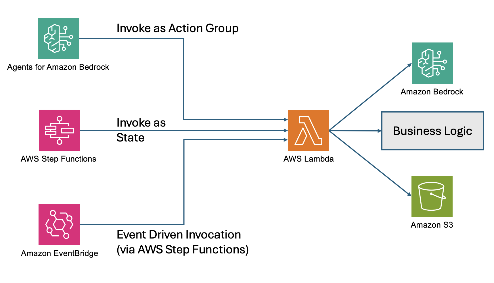

1. **マルチエージェントコラボレーション**
    - **事業開発マルチエージェント（コラボレーター）** - 専門分野に特化した複数のエージェント
    - **事業開発マルチエージェント（スーパーバイザー）** - コラボレーターエージェントを監督・調整するエージェント
2. **エージェンティックワークフロー**
    - **事業開発ワークフロー** - 事前に定義された順序に沿って、各エージェントを実行するワークフロー
3. **イベント駆動エージェント**
    - **CloudFormation分析イベント駆動エージェント** - インフラストラクチャの変更を自動検出・分析

## アーキテクチャの特徴

- **IaC**: AWS CDKを使用して全リソースをコード化
- **サーバーレスアーキテクチャ**: Lambda、Step Functions、DynamoDB、S3などのマネージドサービスを活用
- **様々な利用シーンから利用可能なツール実装** ツールとして利用される AWS Lambda には、Agents for Amazon Bedrock, AWS Step Functions から呼び出すことができるインターフェースが実装されている。
- **具体的なマルチエージェントのユースケース実装** イベント駆動のツール利用、マルチエージェント、エージェンティックワークフローからのツール利用のサンプルコードを提供

## システムアーキテクチャ
### **事業開発マルチエージェント**

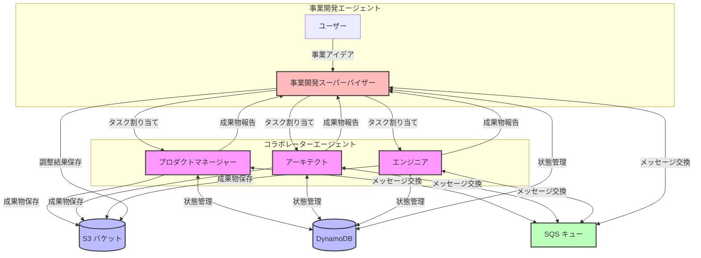
### **事業開発ワークフロー**

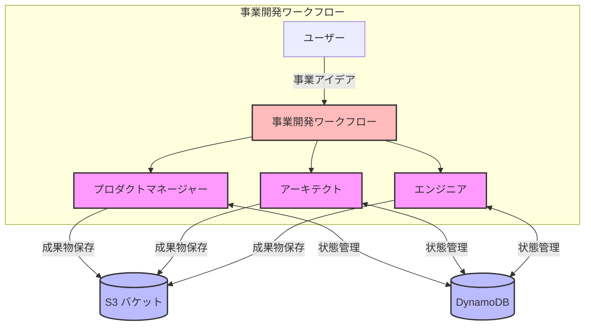
### **CloudFormation分析イベント駆動エージェント**

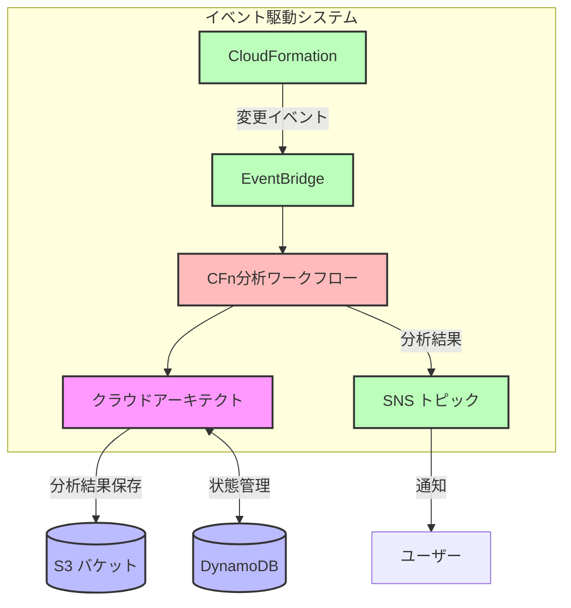


## 主要コンポーネント詳細

### 1. 事業開発マルチエージェント（コラボレーター）

各エージェントは特定の専門分野に特化し、連携して作業します。

#### プロダクトマネージャー

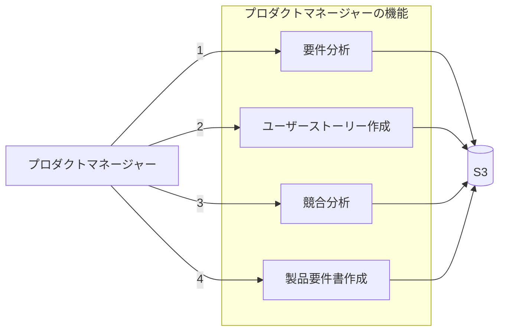

- **要件分析**: ユーザーの要件を詳細に分析し、主要機能やターゲットユーザーを特定
- **ユーザーストーリー作成**: 「〜として、〜したい、なぜなら〜」形式のストーリーを作成
- **競合分析**: 市場の競合製品を分析し、差別化ポイントを特定
- **PRD作成**: 包括的な製品要件書を作成し、開発の指針を提供

#### アーキテクト

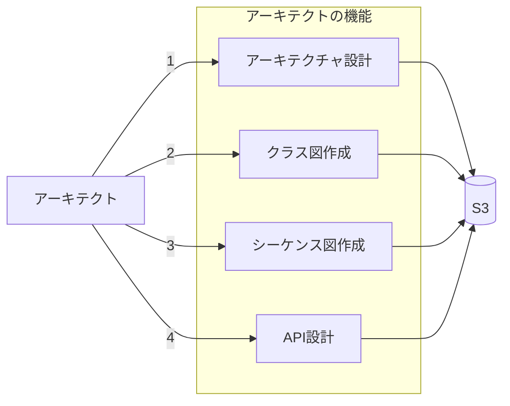

- **アーキテクチャ設計**: システム全体の構造と技術選択を設計
- **クラス図作成**: オブジェクト指向設計のクラス構造をMermaid形式で作成
- **シーケンス図作成**: 重要なユースケースのシーケンス図をMermaid形式で作成
- **API設計**: RESTful APIやGraphQL APIの詳細設計を作成

#### エンジニア

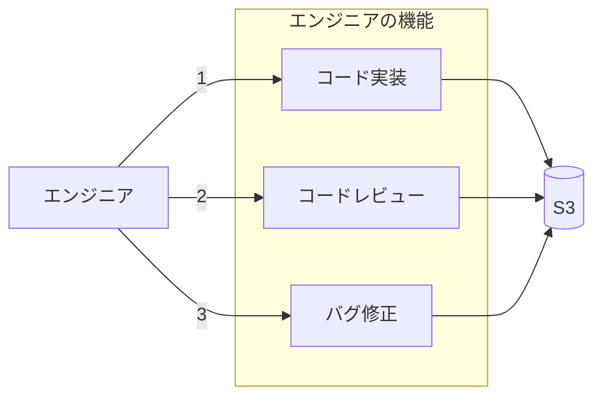

- **コード実装**: アーキテクチャと要件に基づいて実際のコードを実装
- **コードレビュー**: 実装されたコードの品質、パフォーマンス、セキュリティを評価
- **バグ修正**: レビューで特定された問題を修正し、コード品質を向上

### 2. 事業開発マルチエージェント（スーパーバイザー）

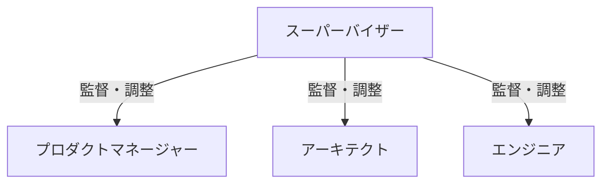

- **エージェント調整**: 各エージェントの役割と作業を適切に割り当て・調整
- **コミュニケーション管理**: エージェント間の情報伝達を円滑化
- **進捗監視**: プロジェクト全体の進捗を監視し、必要に応じて介入
- **品質評価**: 各エージェントの出力の品質を評価し、改善を促進
- **ユーザー橋渡し**: ユーザーとエージェントチーム間のコミュニケーションを仲介

### 3. CloudFormation分析イベント駆動エージェント

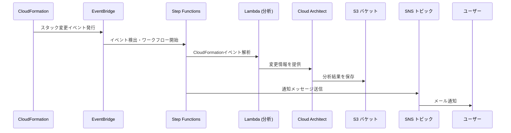

- **自動検出**: CloudFormationスタックの変更を自動的に検出
- **詳細分析**: 変更の原因と影響範囲を詳細に分析
- **修正提案**: 問題解決のための具体的な修正案を提案
- **通知**: 分析結果をSNSトピックを通じて関係者に通知

## 技術スタック詳細

- **AWS CDK**: TypeScriptを使用したインフラストラクチャのコード化
- **AWS Bedrock**: Claude 3.5 Sonnetモデルによる高度な自然言語処理と、Multi Agent Collaboration による複数エージェントのオーケストレーション
- **AWS Lambda**: Python によるサーバーレスな処理の実装
- **AWS Step Functions**: 複雑なワークフローの定義と実行
- **DynamoDB**: エージェント状態と会話履歴の保存
- **S3**: 分析結果、設計文書、実装コードなどの成果物保存
- **SQS/SNS/EventBridge**: イベント駆動型アーキテクチャの実現
- **CloudWatch**: ログ管理、メトリクス監視、アラート設定

## ワークフロー詳細

### 事業開発ワークフロー

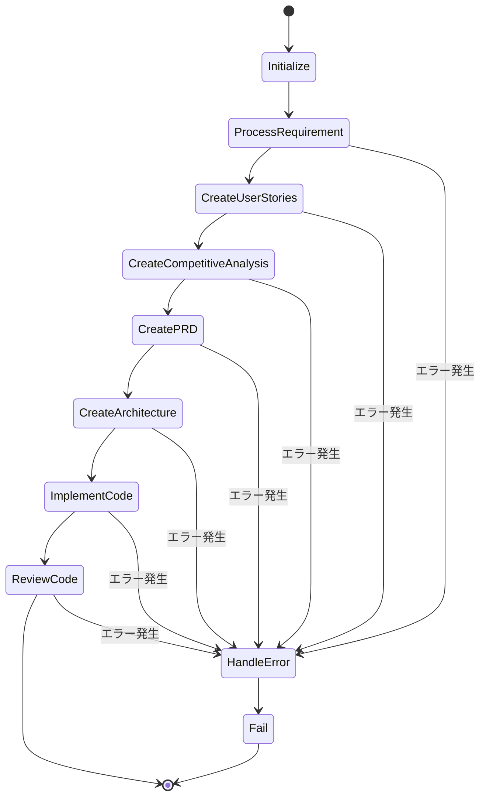

1. **初期化**: プロジェクトIDの生成と必要なフィールドの設定
2. **要件処理**: プロダクトマネージャーによる要件の分析
3. **ユーザーストーリー作成**: ユーザー視点での機能定義
4. **競合分析**: 市場と競合製品の分析
5. **PRD作成**: 包括的な製品要件書の作成
6. **アーキテクチャ作成**: システム設計と技術選択
7. **コード実装**: 実際のコーディング作業
8. **コードレビュー**: 実装の品質評価と改善提案

### CloudFormation分析ワークフロー

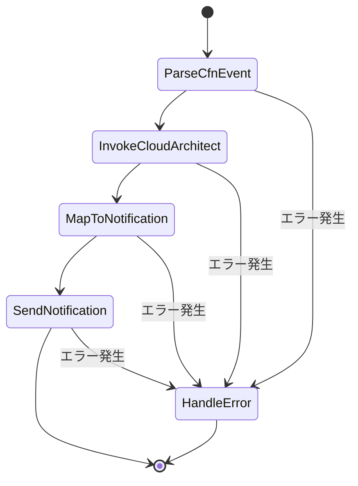

1. **イベント解析**: CloudFormationイベントの詳細を解析
2. **クラウドアーキテクト呼び出し**: 変更分析のためのAIエージェント実行
3. **通知マッピング**: 分析結果を通知形式に変換
4. **通知送信**: SNSトピックを通じて関係者に通知

## インストール方法

### 前提条件

- AWS CLI バージョン 2.0以上
- Node.js バージョン 14.0以上
- npm バージョン 6.0以上
- AWS CDK バージョン 2.0以上
- AWS アカウントと適切な権限を持つIAMユーザー

### 詳細セットアップ手順

1. リポジトリをクローン

```bash
git clone https://gitlab.aws.dev/wmikuriy/multi-agent-samples-jp.git
cd multi-agent-samples-jp
```

2. 依存関係をインストール

```bash
npm install
```

3. CDKをブートストラップ（初回のみ）

```bash
cdk bootstrap
```

4. 環境変数の設定

```bash
# 必須環境変数
export AWS_REGION=us-west-2  # デプロイ先のリージョン

# オプション環境変数
export ENV_NAME=dev  # 環境名（デフォルトは 'dev'）
export NOTIFICATION_EMAIL=your-email@example.com  # 通知用メールアドレス
```

5. デプロイ

```bash
# すべてのスタックをデプロイ
cdk deploy --all

# 特定のスタックのみデプロイ
cdk deploy mas-jp-bizdev-ma-agent-dev
```

6. デプロイ後の確認

```bash
# デプロイされたスタックの一覧を表示
cdk list

# スタックの出力を表示
aws cloudformation describe-stacks --stack-name mas-jp-bizdev-ma-agent-dev --query "Stacks[0].Outputs"
```

## 使用方法

### 事業開発ワークフローの実行

1. AWS Management Consoleにログイン
2. Step Functions コンソールに移動
3. `mas-jp-bizdev-wf-dev-main-workflow` ステートマシンを選択
4. 「実行を開始」ボタンをクリック
5. 以下のような入力を提供:

```json
{
  "requirement": "モバイルアプリで家計簿を管理したい。収入と支出を記録し、カテゴリ別の集計や月次レポートを確認できるようにしたい。また、予算設定と通知機能も欲しい。",
  "user_id": "user123"
}
```

6. 実行の進捗をStep Functions可視化ツールで確認
7. 各ステップの出力をS3バケットで確認

### CloudFormation分析の確認

1. テスト用のCloudFormationスタックを作成し、意図的に失敗させる:

```bash
# 失敗するCloudFormationテンプレートの例
cat > failed-template.yaml << EOF
Resources:
  MyBucket:
    Type: AWS::S3::Bucket
    Properties:
      BucketName: this-bucket-name-probably-exists-already
EOF

# スタックをデプロイ
aws cloudformation create-stack --stack-name test-failure --template-body file://failed-template.yaml
```

2. CloudFormationスタックが失敗すると、自動的に分析が開始される
3. 分析結果は設定されたSNSトピックを通じてメールで通知される
4. Step Functions コンソールで `mas-jp-cfnfa-ed-dev-cfn-analysis` ステートマシンの実行を確認
5. S3バケットで詳細な分析レポートを確認

## 高度な使用例

### カスタムエージェントの追加

このフレームワークは拡張可能で、新しいエージェントタイプを追加できます:

1. 新しいエージェント用のLambda関数を作成:
   - `lambda/action_group/custom/` ディレクトリに新しいフォルダを作成
   - 必要なハンドラーとヘルパー関数を実装

2. エージェントコンストラクトを作成:
   - `lib/constructs/agent/custom/` ディレクトリに新しいファイルを作成
   - 既存のエージェントコンストラクトを参考に実装

3. スタックに新しいエージェントを追加:
   - 適切なスタックファイルを編集し、新しいエージェントを統合

### ワークフローのカスタマイズ

Step Functionsワークフローは柔軟にカスタマイズ可能です:

1. `lib/constructs/workflow/` ディレクトリのファイルを編集
2. 新しいステップの追加、既存ステップの変更、または条件分岐の追加
3. 変更をデプロイして新しいワークフローを適用

### 本番環境で利用する際のセキュリティ上の注意事項

本コードはサンプルコードです。本番環境で利用する際は、以下の点に注意してください：

1. **認証・認可**
   - 適切なIAMロールとポリシーを設定し、最小権限の原則に従う
   - APIエンドポイントにはCognitoやAPI Gatewayの認証を実装する

2. **データ保護**
   - S3バケットの暗号化（SSE-S3、SSE-KMS）を有効化
   - DynamoDBテーブルの暗号化を有効化
   - 転送中のデータにはTLS/SSLを使用
   - 機密情報はAWS Secrets Managerで管理

3. **ガードレール**
   - Bedrockモデルに適切なガードレールを設定し、有害な出力を防止
   - 入力検証と出力フィルタリングを実装
   - エージェントの行動範囲と権限を明確に制限
   
その他、LLMを利用したアプリケーションにおけるセキュリティ対策として [OWASP Top 10 for Large Language Model Applications](https://owasp.org/www-project-top-10-for-large-language-model-applications/) などを参照してください。


## プロジェクト構成詳細

```
.
├── bin/                      # CDKアプリケーションのエントリーポイント
│   └── multiagent-framework.ts  # メインCDKアプリ定義
├── lib/                      # CDKスタックとコンストラクト
│   ├── constructs/           # 再利用可能なコンストラクト
│   │   ├── agent/            # エージェント定義
│   │   │   ├── aws/          # AWSに特化したエージェント
│   │   │   │   ├── cloud-architect.ts    # クラウドアーキテクトエージェント
│   │   │   │   ├── index.ts              # AWSエージェントのエクスポート
│   │   │   │   └── serverless-architect.ts # サーバーレスアーキテクトエージェント
│   │   │   └── bizdev/       # 事業開発エージェント
│   │   │       ├── architect.ts          # アーキテクトエージェント
│   │   │       ├── data-interpreter.ts   # データインタープリターエージェント
│   │   │       ├── engineer.ts           # エンジニアエージェント
│   │   │       ├── index.ts              # 事業開発エージェントのエクスポート
│   │   │       └── product-manager.ts    # プロダクトマネージャーエージェント
│   │   ├── event-driven/     # イベント駆動型コンストラクト
│   │   │   └── cloudformation-analysis.ts # CloudFormation分析コンストラクト
│   │   ├── infrastructure/   # インフラストラクチャリソース
│   │   │   ├── api-lambda.ts            # API Lambda関数
│   │   │   ├── lambda-resources.ts      # Lambda共通リソース
│   │   │   ├── messaging-resources.ts   # メッセージングリソース
│   │   │   └── storage-resources.ts     # ストレージリソース
│   │   ├── multi-agents/     # マルチエージェント連携
│   │   │   └── bizdev/       # 事業開発マルチエージェント
│   │   │       └── bizdev-supervisor.ts  # 事業開発スーパーバイザー
│   │   └── workflow/         # ワークフロー定義
│   │       └── bizdev-workflow.ts       # 事業開発ワークフロー
│   ├── bizdev-ma-agent-stack.ts    # 事業開発マルチエージェントスタック
│   ├── bizdev-ma-supervisor-stack.ts # スーパーバイザースタック
│   ├── bizdev-wf-stack.ts    # 事業開発ワークフロースタック
│   └── cfnfa-ed-stack.ts     # CloudFormation分析スタック
├── lambda/                   # Lambda関数のソースコード
│   └── action_group/         # エージェントアクショングループ
│       ├── aws/              # AWS関連Lambda
│       │   ├── cfn-event-parser/       # CloudFormationイベント解析
│       │   ├── cloud-architect/        # クラウドアーキテクト
│       │   └── serverless-architect/   # サーバーレスアーキテクト
│       └── bizdev/           # 事業開発関連Lambda
│           ├── architect/              # アーキテクト
│           ├── engineer/               # エンジニア
│           └── product-manager/        # プロダクトマネージャー
├── package.json              # プロジェクト依存関係
└── tsconfig.json             # TypeScript設定
```


## Security

See [CONTRIBUTING](CONTRIBUTING.md#security-issue-notifications) for more information.

## License

This library is licensed under the MIT-0 License. See the LICENSE file.

