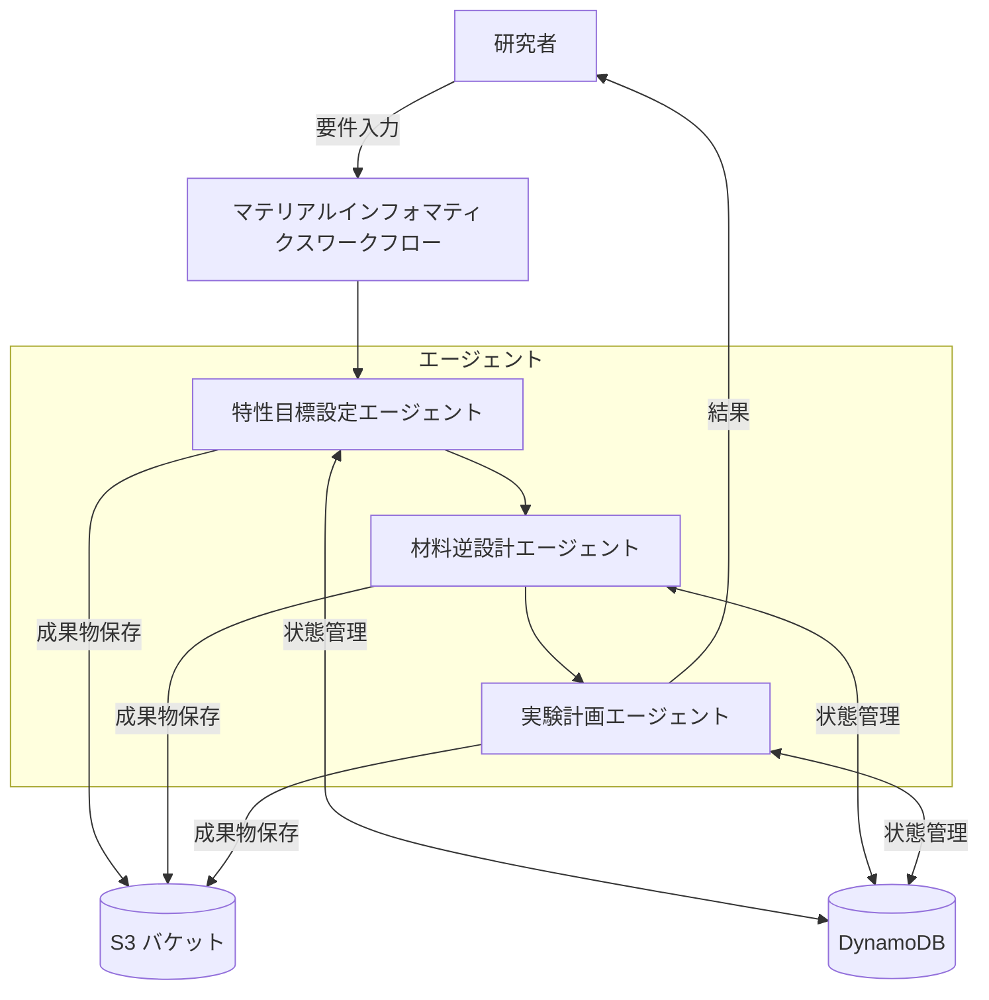
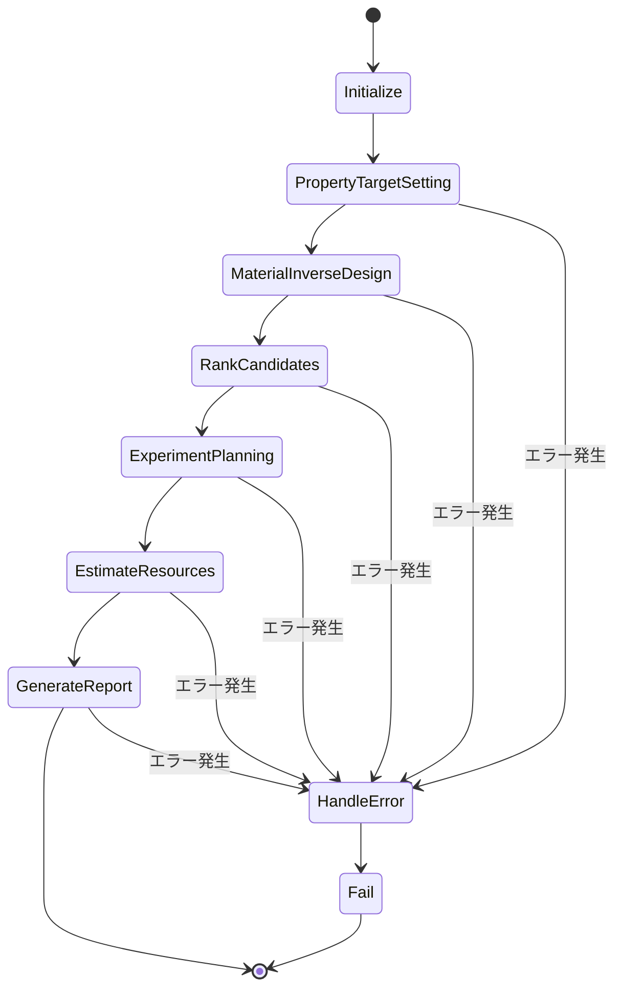

# マテリアルインフォマティクスエージェント オンボーディングドキュメント

## 1. はじめに

このドキュメントでは、半導体材料のマテリアルインフォマティクス研究者向けに実装されたAIエージェントシステムについて説明します。このシステムは、AWS Bedrockを活用したマルチエージェントフレームワークの上に構築されており、材料設計から実験計画までのワークフローを自動化・効率化することを目的としています。

### 1.1 システムの目的

このシステムは以下の目的で設計されています：

- 半導体材料の目標特性を科学的に設定する
- 目標特性から最適な材料組成・構造を逆予測する
- 提案された材料の検証実験を効率的に計画する
- 研究サイクルを加速し、革新的な材料発見を促進する

### 1.2 システム概要

システムは主に3つのエージェントと、それらを連携させるワークフローで構成されています：

1. **特性目標設定エージェント (PropertyTargetAgent)**
   - 要件から目標特性を設定
   - 特性間のトレードオフを分析
   - 目標特性の実現可能性を検証

2. **材料逆設計エージェント (InverseDesignAgent)**
   - 目標特性から材料を設計
   - 候補材料をランク付け
   - 材料の合成可能性を評価

3. **実験計画エージェント (ExperimentPlanningAgent)**
   - 実験計画を作成
   - 実験条件を最適化
   - 実験リソースを見積もり

これらのエージェントは、Step Functionsで定義されたワークフローによって連携し、一連の材料設計・検証プロセスを自動化します。

## 2. システムアーキテクチャ

### 2.1 全体アーキテクチャ



### 2.2 技術スタック

- **AWS Bedrock**: Claude 3.5 Sonnetモデルによる推論
- **AWS Lambda**: エージェントのビジネスロジック
- **AWS Step Functions**: ワークフローの定義と実行
- **Amazon DynamoDB**: エージェント状態と会話履歴の保存
- **Amazon S3**: 成果物の保存
- **Amazon SQS**: エージェント間のメッセージング
- **Amazon EventBridge**: イベント駆動型通信
- **AWS CDK**: インフラストラクチャのコード化

### 2.3 ワークフロー



## 3. エージェント詳細

### 3.1 特性目標設定エージェント (PropertyTargetAgent)

#### 3.1.1 役割と責任

特性目標設定エージェントは、ユーザーの要件に基づいて半導体材料の目標特性を設定し、特性間のトレードオフを分析します。このエージェントは材料科学の専門知識を活用して、実現可能で最適な特性セットを提案します。

#### 3.1.2 主要機能

1. **set_target_properties**
   - **入力**: ユーザーの材料要件（例：「高効率な太陽電池用半導体材料が必要」）
   - **処理**: 要件を分析し、具体的な目標特性（バンドギャップ、キャリア移動度など）を設定
   - **出力**: 目標特性セット（値、単位、許容範囲、優先度を含む）

2. **analyze_tradeoffs**
   - **入力**: 目標特性セット
   - **処理**: 特性間のトレードオフ関係を分析（例：バンドギャップと光吸収効率のトレードオフ）
   - **出力**: トレードオフ分析結果と最適バランスの提案

3. **validate_targets**
   - **入力**: 目標特性セット
   - **処理**: 特性の物理的・化学的な実現可能性を検証
   - **出力**: 検証結果と必要に応じた調整提案

#### 3.1.3 実装詳細

特性目標設定エージェントは、AWS Lambda関数として実装されています。この関数は、AWS Bedrockの大規模言語モデル（Claude 3.5 Sonnet）を使用して、材料科学の専門知識に基づいた推論を行います。

エージェントの状態とメッセージ履歴はDynamoDBに保存され、成果物（目標特性セットなど）はS3バケットに保存されます。エージェントは、EventBridgeを通じてイベントを発行し、他のエージェントやシステムコンポーネントと通信します。

### 3.2 材料逆設計エージェント (InverseDesignAgent)

#### 3.2.1 役割と責任

材料逆設計エージェントは、目標特性から最適な材料組成・構造を逆予測します。このエージェントは、機械学習モデルを活用して、目標特性を満たす可能性のある候補材料を生成し、それらをランク付けします。

#### 3.2.2 主要機能

1. **design_materials**
   - **入力**: 目標特性セット、制約条件（コスト、毒性など）
   - **処理**: 目標特性を満たす可能性のある材料組成・構造を生成
   - **出力**: 候補材料のリスト（組成、構造、予測特性を含む）

2. **rank_candidates**
   - **入力**: 候補材料リスト、ランク付け基準
   - **処理**: 目標特性との一致度、合成可能性、コストなどに基づいて候補材料をランク付け
   - **出力**: ランク付けされた候補材料リスト

3. **evaluate_feasibility**
   - **入力**: 評価対象の材料
   - **処理**: 材料の熱力学的安定性、合成可能性、既知の合成手法との互換性を評価
   - **出力**: 合成可能性評価結果と推奨合成手法

#### 3.2.3 実装詳細

材料逆設計エージェントも、AWS Lambda関数として実装されています。このエージェントは、特性目標設定エージェントと同様に、AWS Bedrockの大規模言語モデルを使用して推論を行います。

実際の実装では、材料データベース（Materials Project、AFLOWなど）との連携や、専用の機械学習モデル（VAE、GANなど）の統合も可能です。現在のサンプル実装では、モック応答を返していますが、実際のシステムでは、これらの外部リソースと連携することで、より精度の高い材料設計が可能になります。

### 3.3 実験計画エージェント (ExperimentPlanningAgent)

#### 3.3.1 役割と責任

実験計画エージェントは、提案された材料の検証実験を計画し、最適な実験条件を提案します。このエージェントは、最小限の実験で最大の情報を得るための実験設計を行い、必要なリソースを見積もります。

#### 3.3.2 主要機能

1. **create_experiment_plan**
   - **入力**: 検証対象の材料リスト、目標特性、利用可能な実験装置
   - **処理**: 最適な実験設計（実験タイプ、条件、順序など）を作成
   - **出力**: 詳細な実験計画

2. **optimize_conditions**
   - **入力**: 最適化対象の実験、最適化目標
   - **処理**: 実験条件（温度、圧力、時間など）を最適化
   - **出力**: 最適化された実験条件と期待される改善効果

3. **estimate_resources**
   - **入力**: 実験計画
   - **処理**: 実験に必要なリソース（時間、材料、装置、人員、コスト）を見積もり
   - **出力**: 詳細なリソース見積もり

#### 3.3.3 実装詳細

実験計画エージェントも、AWS Lambda関数として実装されています。このエージェントは、実験設計の原則と材料科学の知識を組み合わせて、効率的な実験計画を作成します。

実際のシステムでは、実験機器のスケジューリングシステムや、実験データ管理システムとの連携も可能です。これにより、実験の自動化や、実験結果のフィードバックに基づく計画の最適化が可能になります。

## 4. システムの実装

### 4.1 ディレクトリ構造

マテリアルインフォマティクスエージェントシステムは、以下のディレクトリ構造で実装されています：

```
.
├── lambda/
│   └── action_group/
│       └── materials/
│           ├── property_target/
│           │   ├── action_group_description.txt  # エージェント機能の説明
│           │   └── index.py                      # Lambda関数のコード
│           ├── inverse_design/
│           │   ├── action_group_description.txt
│           │   └── index.py
│           └── experiment_planning/
│               ├── action_group_description.txt
│               └── index.py
├── lib/
│   ├── constructs/
│   │   ├── agent/
│   │   │   └── materials/
│   │   │       ├── property-target.ts            # 特性目標設定エージェントのCDKコンストラクト
│   │   │       ├── inverse-design.ts             # 材料逆設計エージェントのCDKコンストラクト
│   │   │       ├── experiment-planning.ts        # 実験計画エージェントのCDKコンストラクト
│   │   │       └── index.ts                      # エクスポート定義
│   │   └── workflow/
│   │       └── materials-workflow.ts             # ワークフローのCDKコンストラクト
│   └── materials-workflow-stack.ts               # CDKスタック定義
└── bin/
    └── multiagent-framework.ts                   # CDKアプリケーションのエントリーポイント
```

### 4.2 Lambda関数の実装

各エージェントはLambda関数として実装されています。Lambda関数は、AWS Bedrockの大規模言語モデルを使用して推論を行い、結果をS3バケットに保存します。

#### 4.2.1 共通構造

各Lambda関数は以下の共通構造を持っています：

1. **エージェントクラス**: 各エージェントの機能を実装するクラス
2. **処理メソッド**: 各機能（set_target_properties、design_materialsなど）を実装するメソッド
3. **ハンドラー関数**: Lambda関数のエントリーポイント
4. **ヘルパーメソッド**: LLMの応答を解析するなどのユーティリティメソッド

#### 4.2.2 Lambda関数の例（特性目標設定エージェント）

```python
class PropertyTargetAgent(Agent):
    """特性目標設定エージェント"""
    
    def __init__(self, agent_id: str = None):
        super().__init__(
            agent_id=agent_id,
            agent_type="property_target",
            agent_state_table=AGENT_STATE_TABLE,
            message_history_table=MESSAGE_HISTORY_TABLE,
            artifacts_bucket=ARTIFACTS_BUCKET,
            communication_queue_url=COMMUNICATION_QUEUE_URL,
            event_bus_name=EVENT_BUS_NAME
        )
    
    def process(self, input_data: Dict[str, Any]) -> Dict[str, Any]:
        """入力データを処理"""
        process_type = input_data.get('process_type', 'set_target_properties')
        
        if process_type == 'set_target_properties':
            return self.set_target_properties(input_data)
        elif process_type == 'analyze_tradeoffs':
            return self.analyze_tradeoffs(input_data)
        elif process_type == 'validate_targets':
            return self.validate_targets(input_data)
        else:
            raise ValueError(f"Unknown process type: {process_type}")
    
    def set_target_properties(self, input_data: Dict[str, Any]) -> Dict[str, Any]:
        """目標特性を設定"""
        # LLMに目標特性設定を依頼
        messages = [
            {"role": "system", "content": "You are a materials science expert..."},
            {"role": "user", "content": f"Define target properties for semiconductor materials..."}
        ]
        
        response = self.ask_llm(messages)
        
        # 結果を解析して返す
        target_properties = self._parse_target_properties(response.get('content', ''))
        return {
            "status": "success",
            "session_id": session_id,
            "target_properties": target_properties,
            "s3_key": s3_key
        }
```

### 4.3 CDKコンストラクトの実装

各エージェントとワークフローは、AWS CDKを使用してインフラストラクチャとして定義されています。

#### 4.3.1 エージェントコンストラクト

エージェントコンストラクトは、Lambda関数、IAMロール、Bedrock Agentなどのリソースを定義します。

```typescript
export class PropertyTarget extends Construct {
  public readonly propertyTargetAlias: bedrock.AgentAlias;  
  public readonly propertyTargetLambda: lambda.Function;

  constructor(scope: Construct, id: string, props: PropertyTargetProps) {
    super(scope, id);

    // Lambda関数の定義
    this.propertyTargetLambda = new lambda.Function(this, 'PropertyTargetFunction', {
      runtime: lambda.Runtime.PYTHON_3_13,
      code: lambda.Code.fromAsset('lambda/action_group/materials/property_target'),
      handler: 'index.handler',
      // ...その他の設定
    });

    // Bedrock Agentの定義
    const agent = new bedrock.Agent(this, 'PropertyTargetAgent', {
      foundationModel: bedrock.BedrockFoundationModel.ANTHROPIC_CLAUDE_3_5_SONNET_V2_0,
      userInputEnabled: true,
      shouldPrepareAgent: true,
      instruction: `You are a Materials Science Expert...`,
    });

    // アクショングループの定義
    const propertyTargetActionGroup = new bedrock.AgentActionGroup({
      name: 'propertyTargetLambda',
      executor: bedrock.ActionGroupExecutor.fromlambdaFunction(this.propertyTargetLambda),
      enabled: true,
      functionSchema: schema
    });

    agent.addActionGroup(propertyTargetActionGroup);

    // Aliasの定義
    this.propertyTargetAlias = new bedrock.AgentAlias(this, 'PropertyTargetAlias', {
      agent: agent,
      description: 'Property Target Agent for Materials Informatics'
    });
  }
}
```

#### 4.3.2 ワークフローコンストラクト

ワークフローコンストラクトは、Step Functionsステートマシンを定義します。

```typescript
export class MaterialsWorkflow extends Construct {
  public readonly stateMachine: sfn.StateMachine;

  constructor(scope: Construct, id: string, props: MaterialsWorkflowProps) {
    super(scope, id);

    // 各ステートの定義
    const initialize = new sfn.Pass(this, 'Initialize', {
      parameters: {
        'status': 'initialized',
        'session_id.$': '$$.Execution.Name',
        // ...その他のパラメータ
      },
    });
    
    const propertyTargetSetting = new tasks.LambdaInvoke(this, 'PropertyTargetSetting', {
      lambdaFunction: props.propertyTargetLambda,
      payload: sfn.TaskInput.fromObject({
        'process_type': 'set_target_properties',
        // ...その他のパラメータ
      }),
      resultPath: '$.property_target_result',
    });
    
    // ...その他のステート定義
    
    // ステートの接続
    initialize.next(propertyTargetSetting);
    propertyTargetSetting.next(materialInverseDesign);
    // ...その他の接続
    
    // ステートマシンの作成
    this.stateMachine = new sfn.StateMachine(this, 'MaterialsWorkflow', {
      stateMachineName: `${props.projectName}-${props.envName}-materials-workflow`,
      definitionBody: sfn.DefinitionBody.fromChainable(initialize),
      // ...その他の設定
    });
  }
}
```

### 4.4 CDKスタックの実装

CDKスタックは、すべてのリソース（エージェント、ワークフロー、共有リソースなど）を組み合わせて、デプロイ可能なユニットを定義します。

```typescript
export class MaterialsWorkflowStack extends cdk.Stack {
  constructor(scope: Construct, id: string, props: MaterialsWorkflowStackProps) {
    super(scope, id, props);

    // 共有リソースの作成
    const agentStateTable = new dynamodb.Table(this, 'AgentStateTable', {
      // ...テーブル設定
    });

    const messageHistoryTable = new dynamodb.Table(this, 'MessageHistoryTable', {
      // ...テーブル設定
    });

    const artifactsBucket = new s3.Bucket(this, 'ArtifactsBucket', {
      // ...バケット設定
    });

    // ...その他の共有リソース

    // エージェントの作成
    const propertyTarget = new PropertyTarget(this, 'PropertyTarget', {
      // ...プロパティ
    });

    const inverseDesign = new InverseDesign(this, 'InverseDesign', {
      // ...プロパティ
    });

    const experimentPlanning = new ExperimentPlanning(this, 'ExperimentPlanning', {
      // ...プロパティ
    });

    // ワークフローの作成
    const materialsWorkflow = new MaterialsWorkflow(this, 'MaterialsWorkflow', {
      // ...プロパティ
    });

    // 出力の定義
    new cdk.CfnOutput(this, 'PropertyTargetAgentAlias', {
      value: propertyTarget.propertyTargetAlias.aliasId,
      description: 'Property Target Agent Alias ID',
    });

    // ...その他の出力
  }
}
```
## 5. システムの使用方法

### 5.1 前提条件

システムを使用するには、以下の前提条件が必要です：

- AWS アカウント
- AWS CLI（バージョン2.0以上）
- Node.js（バージョン14.0以上）
- AWS CDK（バージョン2.0以上）
- 適切な権限を持つIAMユーザー
- AWS Bedrockへのアクセス権限（Claude 3.5 Sonnetモデルの使用権限を含む）

### 5.2 デプロイ方法

#### 5.2.1 リポジトリのクローン

```bash
git clone https://gitlab.aws.dev/wmikuriy/multi-agent-samples-jp.git
cd multi-agent-samples-jp
```

#### 5.2.2 依存関係のインストール

```bash
npm install
```

#### 5.2.3 CDKのブートストラップ（初回のみ）

```bash
cdk bootstrap
```

#### 5.2.4 環境変数の設定

```bash
# 必須環境変数
export AWS_REGION=us-west-2  # デプロイ先のリージョン

# オプション環境変数
export ENV_NAME=dev  # 環境名（デフォルトは 'dev'）
export NOTIFICATION_EMAIL=your-email@example.com  # 通知用メールアドレス
```

#### 5.2.5 デプロイ

```bash
# マテリアルインフォマティクスワークフロースタックのみデプロイ
cdk deploy masjp-materials-wf-dev

# すべてのスタックをデプロイ
cdk deploy --all
```

#### 5.2.6 デプロイ後の確認

```bash
# デプロイされたスタックの一覧を表示
cdk list

# スタックの出力を表示
aws cloudformation describe-stacks --stack-name masjp-materials-wf-dev --query "Stacks[0].Outputs"
```

### 5.3 ワークフローの実行

#### 5.3.1 AWS Management Consoleからの実行

1. AWS Management Consoleにログイン
2. Step Functions コンソールに移動
3. `masjp-materials-wf-dev-materials-workflow` ステートマシンを選択
4. 「実行を開始」ボタンをクリック
5. 以下のような入力を提供:

```json
{
  "requirements": "高効率な太陽電池用半導体材料が必要。バンドギャップは1.4-1.6 eV、キャリア移動度は高く、コストは中程度であること。",
  "user_id": "researcher123"
}
```

6. 実行の進捗をStep Functions可視化ツールで確認
7. 各ステップの出力をS3バケットで確認

#### 5.3.2 AWS CLIからの実行

```bash
# ステートマシンのARNを取得
STATE_MACHINE_ARN=$(aws cloudformation describe-stacks --stack-name masjp-materials-wf-dev --query "Stacks[0].Outputs[?OutputKey=='MaterialsWorkflowArn'].OutputValue" --output text)

# 実行を開始
aws stepfunctions start-execution \
  --state-machine-arn $STATE_MACHINE_ARN \
  --input '{"requirements": "高効率な太陽電池用半導体材料が必要。バンドギャップは1.4-1.6 eV、キャリア移動度は高く、コストは中程度であること。", "user_id": "researcher123"}'
```

### 5.4 結果の確認

#### 5.4.1 Step Functions実行結果の確認

1. Step Functions コンソールで実行の詳細を表示
2. 「実行イベント履歴」タブで各ステップの入出力を確認
3. 「グラフ検査」タブでワークフローの視覚的な進捗を確認

#### 5.4.2 S3バケットの成果物の確認

1. S3コンソールに移動
2. `masjp-dev-artifacts-{account-id}-{region}` バケットを選択
3. 以下のようなパスで成果物を確認:
   - `property_target/{session_id}/target_properties.json`
   - `inverse_design/{session_id}/candidate_materials.json`
   - `experiment_planning/{session_id}/experiment_plan.json`

#### 5.4.3 DynamoDBのエージェント状態の確認

1. DynamoDBコンソールに移動
2. `masjp-dev-agent-state` テーブルを選択
3. セッションIDでフィルタリングして、エージェントの状態履歴を確認

### 5.5 個別エージェントの使用

各エージェントは、Bedrock Agentとしても利用可能です。Bedrock Agentコンソールから、以下のエージェントを見つけることができます：

- PropertyTargetAgent
- InverseDesignAgent
- ExperimentPlanningAgent

これらのエージェントと直接対話することで、ワークフローの個別のステップを実行することができます。

## 6. カスタマイズと拡張

### 6.1 新しいエージェント機能の追加

既存のエージェントに新しい機能を追加するには、以下の手順に従います：

1. Lambda関数に新しいメソッドを追加:

```python
def new_function(self, input_data: Dict[str, Any]) -> Dict[str, Any]:
    """新しい機能の説明"""
    # 実装
    return {
        "status": "success",
        "result": result
    }
```

2. `process`メソッドに新しい機能を追加:

```python
def process(self, input_data: Dict[str, Any]) -> Dict[str, Any]:
    process_type = input_data.get('process_type', 'default_function')
    
    if process_type == 'new_function':
        return self.new_function(input_data)
    # 既存の条件分岐
```

3. `action_group_description.txt`に新しい機能の説明を追加
4. CDKコンストラクトのスキーマ定義に新しい機能を追加

### 6.2 新しいエージェントの追加

新しいエージェントを追加するには、以下の手順に従います：

1. 新しいエージェントのディレクトリを作成:

```bash
mkdir -p lambda/action_group/materials/new_agent
```

2. Lambda関数とアクショングループの説明を作成:

```bash
touch lambda/action_group/materials/new_agent/index.py
touch lambda/action_group/materials/new_agent/action_group_description.txt
```

3. CDKコンストラクトを作成:

```bash
touch lib/constructs/agent/materials/new-agent.ts
```

4. `index.ts`にエクスポート定義を追加:

```typescript
export * from './new-agent';
```

5. CDKスタックに新しいエージェントを追加

### 6.3 ワークフローのカスタマイズ

ワークフローをカスタマイズするには、`materials-workflow.ts`ファイルを編集します：

1. 新しいステートの追加:

```typescript
const newState = new tasks.LambdaInvoke(this, 'NewState', {
  lambdaFunction: props.newAgentLambda,
  payload: sfn.TaskInput.fromObject({
    'process_type': 'new_function',
    // ...その他のパラメータ
  }),
  resultPath: '$.new_state_result',
});
```

2. ステートの接続を変更:

```typescript
existingState.next(newState);
newState.next(nextExistingState);
```

3. エラーハンドリングの追加:

```typescript
newState.addCatch(handleError, {
  errors: ['States.ALL'],
  resultPath: '$.error',
});
```

### 6.4 外部システムとの連携

#### 6.4.1 材料データベースとの連携

材料データベース（Materials Project、AFLOWなど）と連携するには、APIクライアントを実装します：

```python
def query_materials_database(self, query_params):
    """材料データベースにクエリを実行"""
    # APIクライアントの実装
    return results
```

#### 6.4.2 実験機器との連携

実験機器のAPIと連携するには、専用のコネクタを実装します：

```python
def submit_experiment_to_equipment(self, experiment_plan):
    """実験計画を実験機器に送信"""
    # APIクライアントの実装
    return experiment_id
```

#### 6.4.3 機械学習モデルとの連携

専用の機械学習モデル（VAE、GANなど）と連携するには、SageMakerエンドポイントを使用します：

```python
def invoke_ml_model(self, input_data):
    """機械学習モデルを呼び出す"""
    # SageMaker Runtime clientの使用
    return prediction
```

## 7. トラブルシューティング

### 7.1 一般的な問題と解決策

#### 7.1.1 デプロイエラー

**問題**: CDKデプロイ中にエラーが発生する

**解決策**:
- CDKのバージョンが最新であることを確認
- `cdk diff`コマンドでデプロイ前に変更を確認
- CloudFormationコンソールでエラーの詳細を確認

#### 7.1.2 Lambda関数のエラー

**問題**: Lambda関数が失敗する

**解決策**:
- CloudWatch Logsでエラーメッセージを確認
- Lambda関数のタイムアウト設定を確認
- IAMロールに必要な権限があることを確認

#### 7.1.3 Step Functions実行エラー

**問題**: Step Functions実行が失敗する

**解決策**:
- 実行イベント履歴でエラーの詳細を確認
- 入力データの形式が正しいことを確認
- 各ステートの入出力パスが正しく設定されていることを確認

### 7.2 ログの確認方法

#### 7.2.1 Lambda関数のログ

```bash
# Lambda関数名を指定してログを取得
aws logs get-log-events \
  --log-group-name /aws/lambda/masjp-materials-wf-dev-PropertyTarget-PropertyTargetFunction \
  --log-stream-name $(aws logs describe-log-streams \
    --log-group-name /aws/lambda/masjp-materials-wf-dev-PropertyTarget-PropertyTargetFunction \
    --order-by LastEventTime \
    --descending \
    --limit 1 \
    --query 'logStreams[0].logStreamName' \
    --output text)
```

#### 7.2.2 Step Functionsのログ

```bash
# Step Functionsの実行ARNを指定してログを取得
aws logs get-log-events \
  --log-group-name /aws/states/masjp-dev-materials-workflow \
  --log-stream-name $(aws logs describe-log-streams \
    --log-group-name /aws/states/masjp-dev-materials-workflow \
    --order-by LastEventTime \
    --descending \
    --limit 1 \
    --query 'logStreams[0].logStreamName' \
    --output text)
```

### 7.3 サポートリソース

- AWS Bedrockドキュメント: https://docs.aws.amazon.com/bedrock/
- AWS CDKドキュメント: https://docs.aws.amazon.com/cdk/
- AWS Step Functionsドキュメント: https://docs.aws.amazon.com/step-functions/
- AWS Lambdaドキュメント: https://docs.aws.amazon.com/lambda/

## 8. まとめ

マテリアルインフォマティクスエージェントシステムは、半導体材料の研究開発プロセスを自動化・効率化するための強力なツールです。このシステムは、AWS Bedrockの大規模言語モデルを活用して、材料設計から実験計画までのワークフローを支援します。

このオンボーディングドキュメントでは、システムの概要、アーキテクチャ、実装詳細、使用方法、カスタマイズ方法、トラブルシューティングについて説明しました。このドキュメントを参考に、マテリアルインフォマティクスエージェントシステムを活用して、材料研究の効率化と革新的な材料の発見を促進してください。

システムの改善や拡張のアイデアがあれば、プロジェクトに貢献することを歓迎します。質問やフィードバックがあれば、プロジェクト管理者にお問い合わせください。
